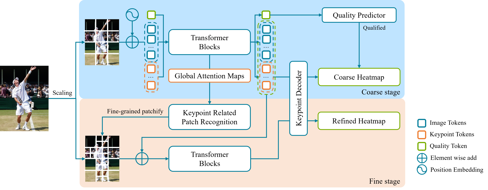

# [AAAI'24] SHaRPose: Sparse High-Resolution Representation for Human Pose Estimation

[ [Paper](https://arxiv.org/abs/2312.10758) ]
[ [Code](https://github.com/AnxQ/sharpose) ]


> High-resolution representation is essential for achieving good performance in human pose estimation models. To obtain such features, existing works utilize high-resolution input images or fine-grained image tokens. However, this dense high-resolution representation brings a significant computational burden. In this paper, we address the following question: ``Only sparse human keypoint locations are detected for human pose estimation, is it really necessary to describe the whole image in a dense, high-resolution manner?" Based on dynamic transformer models, we propose a framework that only uses Sparse High-resolution Representations for human Pose estimation (SHaRPose). In detail, SHaRPose consists of two stages. At the coarse stage, the relations between image regions and keypoints are dynamically mined while a coarse estimation is generated. Then, a quality predictor is applied to decide whether the coarse estimation results should be refined. At the fine stage, SHaRPose builds sparse high-resolution representations only on the regions related to the keypoints and provides refined high-precision human pose estimations. Extensive experiments demonstrate the outstanding performance of the proposed method.


## Preparation

### 0. Requirements
- Linux
- CUDA (devel/runtime) ≥11.6
- conda

### 1. Clone
```bash
git clone https://github.com/AnxQ/sharpose && cd sharpose
```

### 2. Environment
```bash
conda create -n mmlab_0.x python=3.8
conda activate mmlab_0.x

### For GPUs before RTX40XX
conda install pytorch==1.12.1 torchvision==0.13.1 torchaudio==0.12.1 cudatoolkit=11.6 -c pytorch -c conda-forge
pip install mmcv-full -f https://download.openmmlab.com/mmcv/dist/cu116/torch1.12.0/index.html
git clone https://github.com/open-mmlab/mmpose.git && cd mmpose && git switch 0.x
pip install -r requirements.txt
pip install -v . 
cd ..

### For RTX40XX (mod & build mmcv-full from source)
conda install pytorch torchvision torchaudio pytorch-cuda=11.8 -c pytorch -c nvidia

git clone https://github.com/open-mmlab/mmcv.git && cd mmcv && git checkout tags/v1.7.1
pip install -r requirements.txt
sed -i "160s/self._use_replicated_tensor_module/getattr(self, '_use_replicated_tensor_module', None)/g" mmcv/parallel/distributed.py
sed -i 's/-std=c++14/-std=c++17/' setup.py
MMCV_WITH_OPS=1 pip install -v .
cd ..

git clone https://github.com/open-mmlab/mmpose.git && cd mmpose && git switch 0.x
pip install -r requirements.txt
pip install -v . 
cd ..

### Common 
pip install -r requirements.txt
```

### 3. Dataset
- Download and extract COCO following [this](https://mmpose.readthedocs.io/en/0.x/tasks/2d_body_keypoint.html#coco), with the root directory replaced by sharpose.
- Download and extract MPII following [this](https://mmpose.readthedocs.io/en/0.x/tasks/2d_body_keypoint.html#mpii), with the root directory replaced by sharpose.

### 4. Checkpoints
Download checkpoints from [Onedrive](https://1drv.ms/f/c/05c82cc18cdae0cd/Qs3g2ozBLMgggAWisAMAAAAAJScKZ9fGZo1FOw), this link includes following files:
- MAE pretrained checkpoints provided by [MAE](https://github.com/facebookresearch/mae) and [ViTPose](https://github.com/ViTAE-Transformer/ViTPose).
- Well-trained SHaRPose checkpoints.

```
# the directory should be like this
sharpose
├── mmpose
├── mmcv
├── mmcv_custom
├── configs
├── models
├── data
│   ├── mpii
│   └── coco
└── checkpoints
    ├── pretrained
    │   ├── mae_pretrain_vit_base.pth
    │   └── mae_pretrain_vit_small.pth
    └── pose
        ├── sharpose_base_coco_256x192_4xb64_210e.pth
        └── ...
```
## Evaluation
Example for evalutating base model with resolution of 384x288 on 2 GPUs:
```bash
./dist_test.sh configs/sharpose_base_coco_384x288_4xb64_210e.py checkpoints/pose/sharpose_coco_384x288_b_alpha0.3.pth 2
```
## Training
Example for training base model with resolution of 256x192 on 4 GPUs:
```bash
./dist_train.sh configs/sharpose_base_coco_256x192_4xb64_210e.py 4 --cfg-options model.pretrained=checkpoints/pretrained/mae_pretrain_vit_base.pth
```
Note that the pretrained checkpoints is compatible for any settings(e.g. resolutions/alpha) at the same scale(e.g. base/small).
## Visulization

## Citation
This will be changed after AAAI'24 proceedings is released.
```bibtex
@inproceedings{sharpose2024,
    title={SHaRPose: Sparse High-Resolution Representation for Human Pose Estimation},
    booktitle={AAAI},
    author={Xiaoqi An, Lin Zhao, Chen Gong, Nannan Wang, Di Wang, Jian Yang},
    year={2024}
}
```
## Acknowledgement
- MMPose
- TokenPose
- CF-ViT
- ViTPose
- MAE
